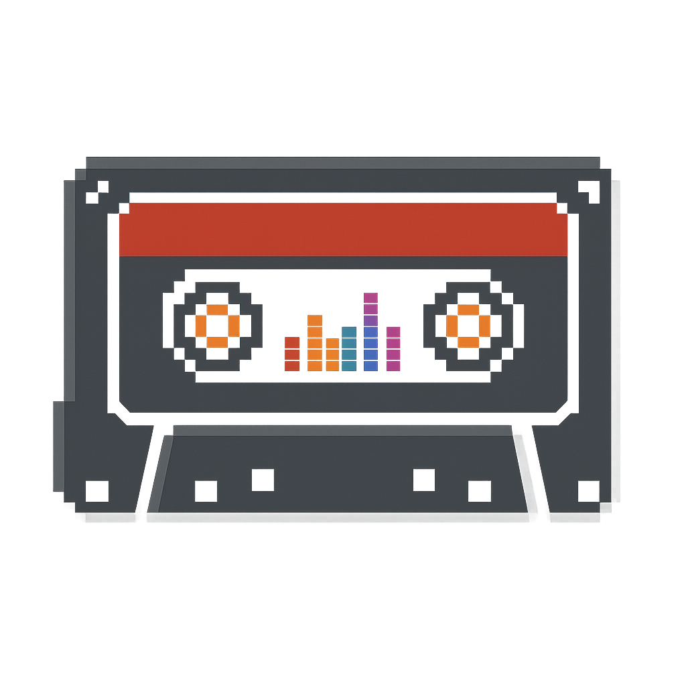
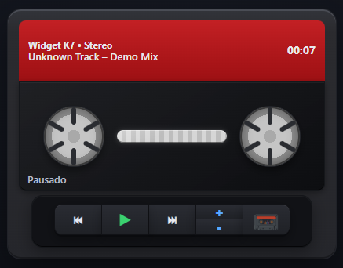

# 🎵 Widget Fita K7

<p align="center">
  
</p>

## 📀 Sobre o Projeto

O **Widget Fita K7 para Windows** é uma aplicação que traz a nostalgia dos anos 80 e 90 para o seu desktop.  
Ele simula uma **fita cassete clássica** em formato de widget, unindo **visual retrô** com **funcionalidades modernas**.  

🎯 **Objetivo principal:** criar uma experiência única de player de música no desktop, com a estética de uma fita cassete, e **tentar integrar com o YouTube Music** para controlar faixas diretamente da interface.  

---

## ✨ Funcionalidades

- 🎚️ **Interface retrô** inspirada em fitas K7 reais.  
- 🎨 **Efeitos visuais** (vidro, brilho e detalhes animados).  
- 🎶 Integração planejada com players de música (com foco no **YouTube Music**).  
- ⚙️ Compatível com Windows, em formato de widget fixo na área de trabalho.  

---

## 🚀 Tecnologias Utilizadas

- **Electron Forge** para criação do executável.  
- **TypeScript** no backend e frontend.  
- **HTML + CSS** para a camada visual.  
- **Node.js** para integração e automação.  

---

## 📷 Preview


---

## 🛠️ Como Rodar o Projeto

1. Clone o repositório:

   ```bash
   git clone https://github.com/seu-usuario/widget-fita-k7.git
   cd widget-fita-k7
